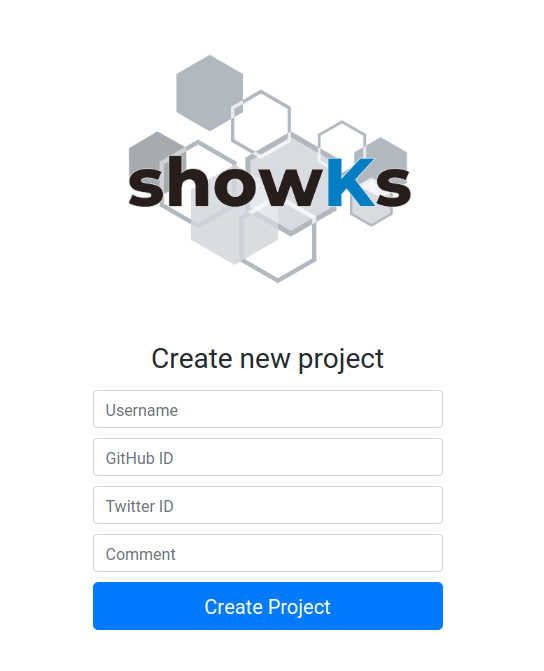

# showKsへの参加方法（簡易版）

1. Githubアカウントを準備
2. [登録フォーム](http://form.stg.showks.containerdays.jp/projects/new)からユーザ登録
3. あなた専用レポジトリ（`https://github.com/containerdaysjp/showks-canvas-ユーザ名`）にアクセス
4. 開発用ブランチ（例：`feature`ブランチ）の作成
5. 開発用ブランチの`src/data/author.json`ファイル内にある`comment`の値を編集してcommit
6. 開発用ブランチから`staging`ブランチへPull Request
7. `staging`ブランチへのPull Requestをmerge
8. [staging環境用のポータル画面](http://portal.stg.showks.containerdays.jp)からあなたのCanvasアプリ内のコメントが更新されることを確認
9. `staging`ブランチから`master`ブランチへPull Request
10. `master`ブランチへのPull Requestをmerge
11. [production環境用のポータル画面](http://portal.prod.showks.containerdays.jp)からあなたのCanvasアプリ内のコメントが更新されることを確認

# showKsへの参加方法（詳細版）

## 1. 事前準備

showKsの参加には[Github](https://github.com)のアカウントが必要です。必ず事前にGithubアカウントを作成し、ユーザ名を確認しておいてください。

## 2. ユーザ登録

[Project一覧](http://form.stg.showks.containerdays.jp/projects/)ページにアクセスし、既存の`Username`を確認します。  

次に画面下部の`New Project`をクリックして[登録フォーム](http://form.stg.showks.containerdays.jp/projects/new)に進みます。　

登録フォームでは、次の情報を入力します。

- **Username（必須）** 
    - showKsで使用するユーザ名です。
    - 既存のUsernameと重複しないようにしてください。
        - 重複した場合、既存データ等を上書きしますのでご注意ください。
    - このユーザ名を元にあなた専用のリポジトリが[Github](https://github.com/containerdaysjp)上に作成されます。
- **Github（必須）** 
    - あなたのGithubアカウント名を入力してください。
    - このアカウントはお絵かきアプリからLinkされます。
    - 存在しないGithubアカウント名が指定された場合はエラーになります。
- **Twitter（必須）** 
    - あなたのTwitterアカウント名を入力してください。
    - このアカウントはお絵かきアプリからLinkされます。
    - Twitterアカウントをお持ちでない場合は`containerdaysjp`を指定します。
- **Comment**
    - 任意のメッセージを入力します。
    - このメッセージはお絵かきアプリに表示されます。

入力が完了したら`Create Project`をクリックしてProjectを新規作成します。

処理の完了までは暫く時間がかかります。画面が遷移し`Project was successfully create`の表示がでるまで待機してください。

## 3. あなた専用リポジトリの確認

ユーザ登録によりあなた専用のリポジトリが自動的に用意されます。
このリポジトリは、[showks-canvas](https://github.com/containerdaysjp/showks-canvas)からForkされたものです。

[Github](https://github.com/containerdaysjp)へアクセスし、あなた専用のリポジトリが作成されていることを確認します。リポジトリ名は`showks-canvas-ユーザ名`で作成されています。検索機能がありますので活用してください。

## 4. あなた専用リポジトリ内へ開発用ブランチ作成

あなた専用のリポジトリには、次のブランチが用意されています。

- staging
    - staging（ステージング）環境用のブランチです。
    - 直接commitはせずに、featureブランチからPull Requestを発行してコードをmergeします。
- master
    - production（本番）環境用のブランチです。
    - 直接commitはせずに、stagingブランチからPull Requestを発行してコードをmergeします。

ここに開発用のブランチを追加します。下図を参考に開発用ブランチを追加してください（今回は例として`feature`ブランチを新規作成します）。

## 5. ソースコードの更新（開発用ブランチ）

作成した開発用ブランチ（図では例として`feature`ブランチを使用）に切り替わっていることを確認し、ファイルブラウザから `srcフォルダ` > `data`フォルダ > `author.json`ファイル の順にアクセスします。

編集ボタンから`author.json`を編集します。ユーザ登録の際に入力した値がjson形式で埋め込まれていますので`comment`の値だけを任意の文字列に置き換えてください。

値を更新後、画面下部の`Commit changes`欄に適切なコメントを入力し、`Commit directly to the staging branch.`にチェックが入っていることを確認してから`Commit changes`ボタンをクリックします。

## 6. 開発用ブランチから`staging`ブランチへPull Requestの発行

開発用ブランチから`staging`ブランチへPull Requestを発行します。画面上部のタブから`Pull requests`を選択し`Compare & pull request`をクリックします。

Pull Requestの送信先が開発用ブランチから`staging`ブランチへなっていることを確認してから`Create pull request`ボタンをクリックします。

## 7. `staging`ブランチへのPull Requestをmerge

`staging`ブランチに開発ブランチからのPull Requestをmergeします。`Merge pull request`をクリックしてから、さらに`Confirm merge`をクリックしてmergeします。

showKsで事前に準備されているパイプライン管理から、mergeを契機にあなたのアプリコンテナが自動的にstaging環境へビルド/デプロイされます。

**注意：`author.json`以外のファイルを更新した場合は制約違反として自動ビルドが中止されます。その他のファイルは更新しないようにご注意ください。**

## 8. アプリ更新の確認（staging環境）

[staging環境用のポータル画面](http://portal.stg.showks.containerdays.jp)から、あなたのCanvasアプリ内のコメントが更新されることを確認します。デプロイが完了するまでは時間が必要となりますので、変更されない場合は少し時間を空けてから再確認してください。

デプロイされたCanvasアプリでは実際にお絵かきをすることが可能です。お絵かきした内容は一定時間後にポータル画面にも反映されますので、確認してみてください。

## 9. `staging`ブランチから`master`ブランチへPull Requestの発行

手順 6. の内容と同様に、`staging`ブランチから`master`ブランチへPull Requestを発行します。

## 10. `master`ブランチへのPull Requestをmerge

手順 7. の内容と同様に、`master`ブランチに`staging`ブランチからのPull Requestをmergeします。

showKsで事前に準備されているパイプライン管理から、mergeを契機にあなたのアプリコンテナが自動的にproduction環境へビルド/デプロイされます。

**注意：`author.json`以外のファイルを更新した場合は制約違反として自動ビルドが中止されます。その他のファイルは更新しないようにご注意ください。**

## 11. アプリ更新の確認（Production環境）

[production環境用のポータル画面](http://portal.prod.showks.containerdays.jp)から、あなたのCanvasアプリ内のコメントが更新されることを確認します。デプロイが完了するまでは時間が必要となりますので、変更されない場合は少し時間を空けてから再確認してください。
