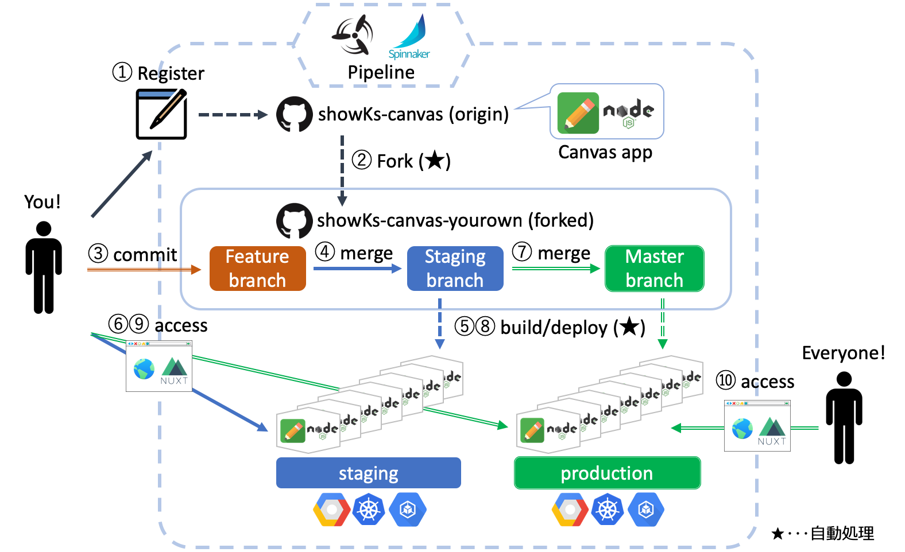

# showKsとは

## 趣旨

日本最大級のコンテナ関連技術カンファレンスである[JapanContainerDays](http://containerdays.jp/)。

kubernetes上で実際にアプリが動く環境を皆さんに見てもらいたい！さらにはクラウドネイティブな開発も体験して欲しい！そんな熱い想いを原動力に、様々な枠組みを超越したスペシャルチームが結成され、苦節○ヶ月、ついにクラウドネイティブな開発をお試しできちゃう参加体験型の “showKs（ショーケース）” が誕生しました！
 
お絵かきアプリ[showks-canvas](https://github.com/containerdaysjp/showks-canvas)を題材に、あなたもクラウドネイティブな開発を体験してみませんか？

## 仕組み

# showKs Canvasアプリ

## 特徴

## ポータルについて

## 制約

# showKsへの参加方法

showKsへの参加およびクラウドネイティブアプリケーション開発体験の手順は、[こちら](./howToJoin.md)をご参照ください。  

# ドキュメントリンク

[showKs-doc](https://github.com/containerdaysjp/showks-docs)

